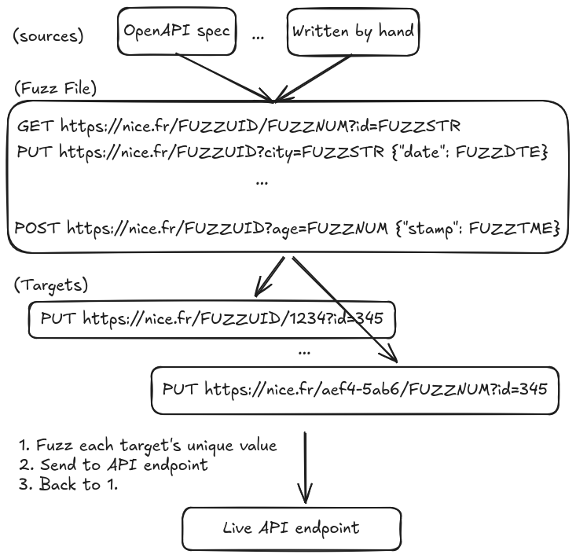

# sfuzz

Simple blackbox fuzzer to harden the validation layer of JSON API endpoints. 

## Features

Compared to other black box API fuzzers this one was designed to have a new particular 
set of features. 

- simple fuzz file format to capture all fuzzing requests at once
- autogeneration of fuzz files from any Open API specification (> 3.x)
- converge quicker via embedded fuzz types and generation of happy path values

Importantly, as a black box fuzzer it does not mutate based on static/dynamic source code feedback.

## Resilient APIs

APIs are a front to many products and businesses. Making their validation layer
handles exotic/unexpected values yield:

- more 4xx business responses and less 5xx status codes
- less noise in logs and alerting 
- less out of bonds and overflows errors
- continuous stress testing of the business validation layer

## LLM Friendly

`sfuzz` is designed so that LLMs can also discover shortcomings in APIs:

- concise, structured and meaningful console outputs
- clear text and no colored console output
- separate steps for fuzz file generation and actual fuzzing

## Install

```console
go install github.com/simcap/sfuzz/cmd/sfuzz
```

## How does it work?

In order for human/LLM to understand how it works have a look at [the SKILL](./skill/use-sfuzz-to-harness-json-api)

#### Diagram


